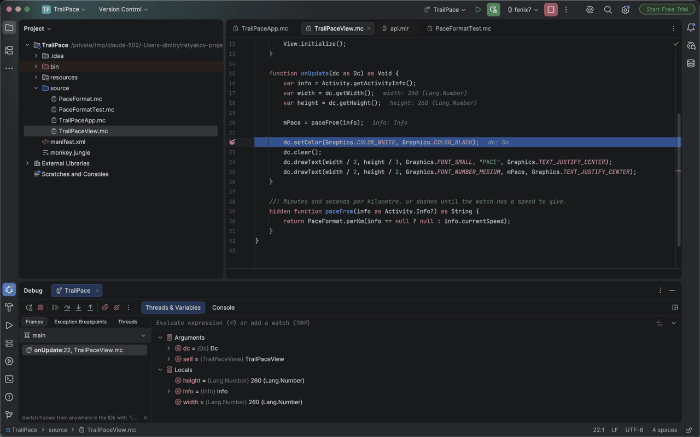

# Monkey C for IntelliJ IDEA

Garmin Connect IQ development in IntelliJ IDEA: writing Monkey C, building, running in the Connect
IQ simulator, and debugging — for watch faces, watch apps, data fields, widgets and barrels.

## Getting started

Five minutes, assuming you have IntelliJ IDEA.

1. **Install the Connect IQ SDK** with [Garmin's SDK Manager](https://developer.garmin.com/connect-iq/sdk/),
   and download at least one device with it. The plugin finds it on its own.
2. **Install this plugin** from *Settings | Plugins*.
   [LSP4IJ](https://plugins.jetbrains.com/plugin/23257-lsp4ij) comes with it.
3. **New Project | Connect IQ**, or open a folder that already has a `monkey.jungle` in it.
4. **Generate a developer key** in *Settings | Languages & Frameworks | Monkey C*. It signs every
   build, and you do not need openssl to make one.
5. **Run.** The watch is chosen in the chip beside the Run button.

Miss a step and the settings page says so, on the control that fixes it.

**Installing from disk instead.** Every tagged release carries a signed zip on the
[Releases page](https://github.com/dtretyakov/idea-monkeyc/releases). Install
[LSP4IJ](https://plugins.jetbrains.com/plugin/23257-lsp4ij) from the Marketplace first — a disk
install will not fetch it — then *Settings | Plugins | ⚙ | Install Plugin from Disk*. Signed, so it
installs without the dialog that asks whether to trust it. Pre-release versions are marked as such.

## What it does

| | |
|---|---|
| **Write code** | Completion, diagnostics, go to definition and rename across the whole Toybox API. |
| **Look up API** | Garmin's own documentation for the symbol under the caret, offline. |
| **Run** | Builds the app and starts it in the Connect IQ simulator. |
| **Debug** | Breakpoints, stepping, variables and expression evaluation in the simulator. |
| **Test** | Runs one `(:test)` function, one file or the whole project, results as a tree. |
| **Target a watch** | The device chip beside Run that every build, run and debug follows. |
| **Watch memory** | Every build reports what it took of that watch's memory and what is left. |
| **Edit manifest** | Devices, permissions and languages as a form instead of hand-written XML. |
| **Sideload** | Builds for the hardware and copies the `.prg` to an attached watch over USB. |
| **Publish** | Exports a signed `.iq`, naming the devices and languages it will drop before it starts. |
| **Start a project** | A new project from the SDK's own templates, and a developer key without openssl. |

## Requirements

* IntelliJ IDEA 2026.1 or newer, or Android Studio 2026.1 (Quail) or newer. It loads in the other
  IntelliJ-based IDEs too; where there is no Build menu, the build commands are in Search
  Everywhere.
* Windows, macOS or Linux — wherever the Connect IQ SDK runs.
* The Connect IQ SDK, installed with Garmin's SDK Manager. Code intelligence needs SDK 8.1.0 or
  newer; building, running and debugging work with older ones.
* [LSP4IJ](https://plugins.jetbrains.com/plugin/23257-lsp4ij), installed alongside this plugin

## More

* [Architecture](docs/architecture.md) — how it is put together, and why
* [Notes on the Connect IQ SDK](docs/sdk-notes.md) — what its tools do that a client must work around
* [Developing](docs/developing.md) — building the plugin, and its two kinds of test
* [Contributing](CONTRIBUTING.md) — bug reports, and the checks a pull request should pass
* [Security](SECURITY.md) — reporting a vulnerability, and what the plugin touches
* [Publishing](PUBLISHING.md) — releases, signing, the Marketplace listing
* [Changelog](CHANGELOG.md)

## Licence

Apache License 2.0; see [LICENSE](LICENSE).

## Trademarks

Garmin, Connect IQ and Monkey C are trademarks of Garmin Ltd. or its subsidiaries, used here only
to name the language this plugin supports and the devices it builds for.

This is an independent, open-source project, not affiliated with or endorsed by Garmin. It
redistributes nothing of Garmin's: it finds the SDK you installed and runs the programs in it.
